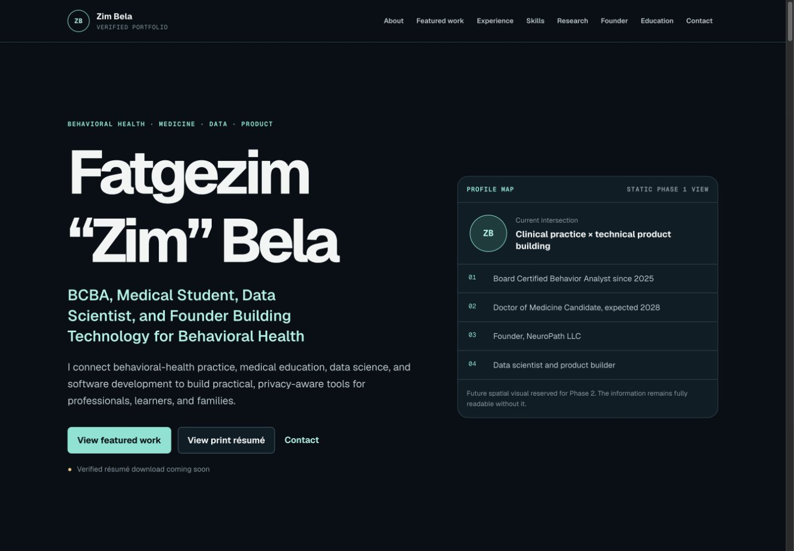
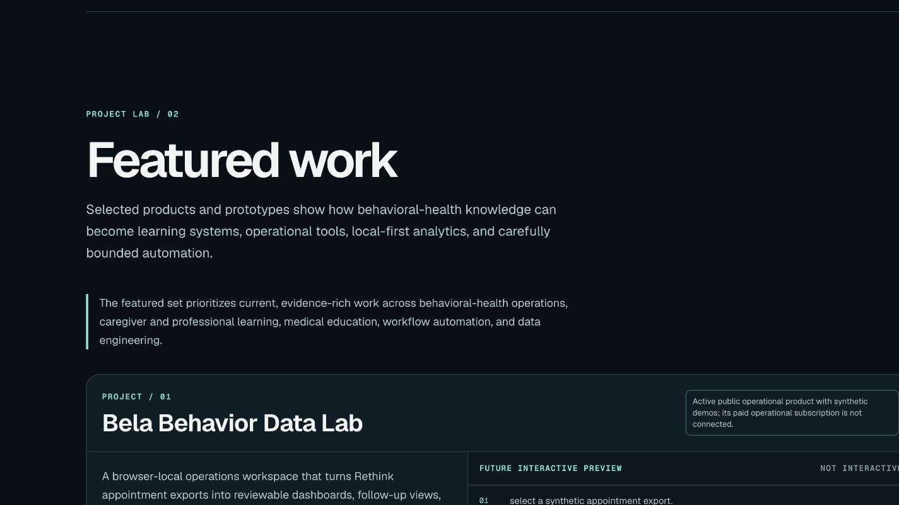
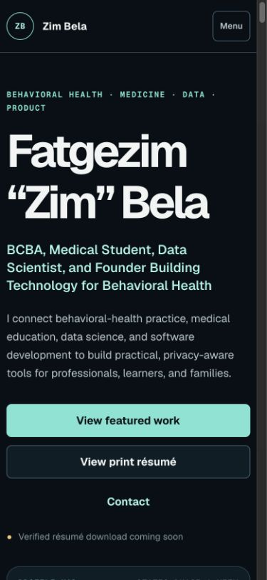
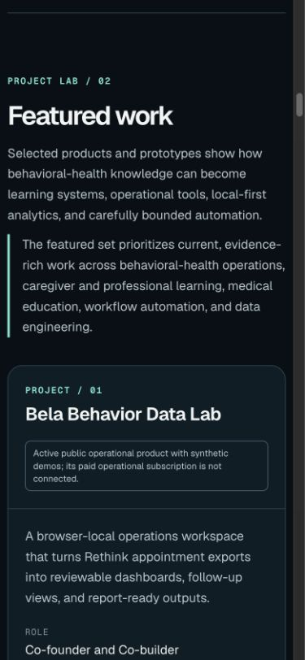
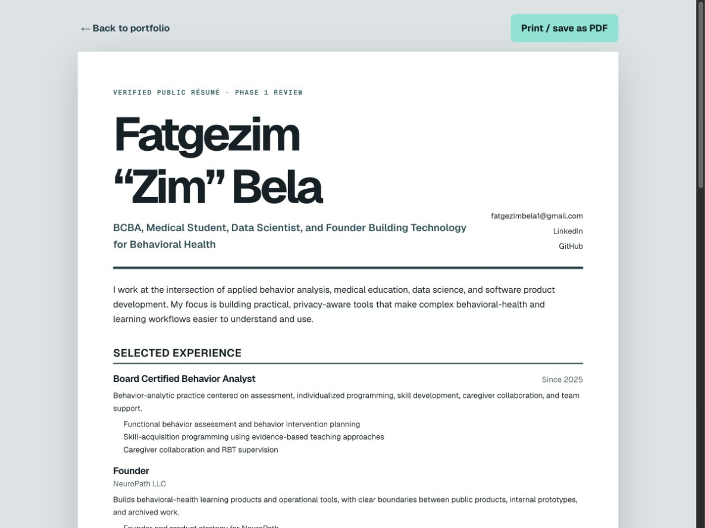

# Phase 1 Owner Review Report

Status: Content and static layout complete — owner approval required

Date: July 13, 2026

Phase boundary: No Phase 2 motion, generated production imagery, parallax, 3D, WebGL, animated project preview, or deployment change is included.

## Outcome

The disposable starter screen has been replaced with a structured, semantic, responsive portfolio and a separate print-friendly résumé route. The implementation uses the owner confirmations received July 13, 2026 and omits every fact the owner left unresolved or directed Codex not to publish.

Public résumé download remains inactive and displays:

`Verified résumé download coming soon`

The private review PDF is stored at `output/pdf/Fatgezim_Zim_Bela_Resume_Phase_1_Review.pdf`, outside `public/`.

## Final proposed positioning

Name:

`Fatgezim “Zim” Bela`

Primary headline:

`BCBA, Medical Student, Data Scientist, and Founder Building Technology for Behavioral Health`

Supporting narrative:

Zim works at the intersection of applied behavior analysis, medical education, data science, software product development, and founder-led behavioral-health technology. The copy distinguishes clinical practice, education in progress, public products, local tools, and private prototypes.

Public contact paths:

- `fatgezimbela1@gmail.com`
- `https://www.linkedin.com/in/fatgezimzimbela/`
- `https://github.com/Fatgezimb`

No phone number, street address, location, or private credential identifier appears.

## Section order and user journeys

1. Hero and current focus.
2. About and cross-domain narrative.
3. Featured work and one default-open evidence detail state.
4. Selected experience.
5. Skills grouped by evidence-backed use.
6. Research and scientific work with explicit evidence boundaries.
7. Founder and company relationships.
8. Education and credentials.
9. Contact and privacy boundary.
10. Separate `/resume` print view.

Recruiter journey: headline → experience → education/credentials → print résumé → contact.

Collaborator journey: about → featured work → evidence boundaries → founder context → contact.

Technical reviewer journey: featured workflows → methods → verified outputs → public evidence links.

## Featured projects

| Project | Score | Public role | Phase 1 treatment |
|---|---:|---|---|
| Bela Behavior Data Lab | 148 | Co-founder and Co-builder | Lead card; public product; synthetic data only. |
| Bela Data Lab Caregiver Academy | 141 | Co-founder, Product Builder, and BCBA Contributor | Active educational product; no individualized-care implication. |
| RBT Practice Hub | 139 | Founder and Product Builder | Public independent learning resource; no BACB endorsement claim. |
| StepSpark | 138 | Creator and Product Builder | Medical-learning prototype; no medical-review or outcome claim. |
| Rethink Automations | 134 | Creator and Developer | Local workflow automation; sanitized static story only. |
| NeuroPath Insight | 132 | Private product concept and internal prototype | Editorial sixth project for deeper data/ML coverage; simulated data only. |

Role Atlas scored 133 and remains the public-safe substitute if the owner prefers not to feature a private prototype. NeuroPath Insight was chosen editorially because it strengthens the behavioral-health data/ML narrative; it is labeled private throughout.

## Excluded or reserved work

- Role Atlas: first reserve and public-safe substitute for NeuroPath Insight.
- Steward Control Room and PracticeOS: private/internal reserves with higher privacy risk.
- NeuroPath LLC ecosystem: founder context rather than a discrete project workflow.
- Behavior Reduction Clinic Training: overlaps stronger learning products and lacks final role clarity.
- ABA Teaching Strategies Training: Meili Bela is the verified creator; no Zim contribution is claimed without documentation.
- Computational neuroscience research: included as research experience, not a featured project, until an artifact supports a specific project/output.
- Spinal Fracture Detection and Project Cleo: omitted pending repository, data, team, and contribution evidence.

## Desktop layout

The desktop layout uses a two-column hero, full-width lead project, two-column supporting project grid, readable experience timeline, grouped capabilities, founder relationship cards, and an education/credential split. Phase 2 visual areas are plainly labeled static placeholders.

## Mobile layout

The mobile layout uses a native disclosure menu, single-column hero/actions, stacked project cards, reflowed timelines, and full-width contact actions. No content depends on hover.

## Print résumé

The `/resume` route provides a readable HTML résumé and Print / Save as PDF action. The generated review artifact is a tagged, unencrypted, two-page US Letter PDF. Page one contains experience and selected product work; page two contains education, credentials, selected skills, and bounded research experience.

The PDF text and rendered pages were inspected. Automated text checks found no phone-like pattern, street-address pattern, disputed employer, Boston University claim, Project Cleo claim, or Spinal Fracture claim.

## Responsive and accessibility review

- Semantic `header`, `nav`, `main`, `section`, and `footer` landmarks are present.
- One `h1` appears on each route; homepage heading order has no level skips.
- Skip link, native links, native disclosure controls, and visible `:focus-visible` treatment are present.
- The mobile menu opens to all eight navigation links; focus outline measured 3 px on the active summary control.
- No duplicate IDs or unnamed links were found.
- No horizontal overflow was found at requested widths 360, 390, 768, 1024, 1280, and 1600 px.
- All visible interactive targets sampled at mobile width measured at least 44 CSS px after correction.
- Sampled contrast ratios ranged from 5.57:1 to 17.45:1.
- No element had an active CSS animation or transition. The layout is inherently reduced-motion safe in Phase 1.
- The print and mobile résumé views had no horizontal overflow.

The browser-control fallback could not advance focus with a synthetic Tab key after opening the native menu, so Phase 1 evidence combines native-control semantics, DOM order, a real focused-control outline check, and direct interaction with the menu. Full assistive-technology and manual keyboard regression remains part of Phase 3.

## Verification results

| Check | Result |
|---|---|
| `npm run lint` | Pass. |
| `npx tsc --noEmit --incremental false` | Pass. Unused Cloudflare/D1 example surfaces are excluded from app type-checking. |
| `npm test` | Pass. Vinext production build completed; four SSR tests pass after the final privacy test was added. |
| `npm run build` | Pass through `npm test`; routes `/` and `/resume` built. |
| `python3 scripts/validate-pack.py` | Recorded in final checkpoint verification. |
| Browser load/error overlay | Pass. Both routes rendered; no final overlay or console warning/error. |
| Responsive/reflow | Pass at 360–1600 px; no horizontal overflow. |
| Contrast sample | Pass; minimum 5.57:1. |
| Reduced-motion/static behavior | Pass; zero active animation/transition elements. |
| External links | Six public URLs returned HTTP 200. LinkedIn returned automated-check code 999, consistent with bot blocking; the URL is owner-confirmed. |
| PDF render/privacy | Pass. Two rendered pages visually inspected; no clipping/overlap; privacy/omission regex checks passed. |

## Tools and action-marker fallbacks

- Repository and content verification used the Phase 0 local file audit, public-link checks, PDF review, and three bounded subagents.
- The expected `agent-browser` executable was unavailable. The bundled in-app browser-control workflow supplied the equivalent load, screenshot, viewport, DOM, interaction, console, and accessibility checks.
- Screenshots were captured from the local Vinext dev server.
- PDF creation used the verified HTML print route rendered through headless Chrome, then Poppler `pdfinfo`, `pdftotext`, and `pdftoppm` for inspection.
- No Figma or image-generation work was needed for the static Phase 1 deliverable. Production visual work remains deferred.

## Files changed

Main implementation:

- `app/content/resume.ts`
- `app/content/projects.ts`
- `app/content/research.ts`
- `app/content/site.ts`
- `app/components/*`
- `app/page.tsx`
- `app/resume/page.tsx`
- `app/layout.tsx`
- `app/globals.css`

Verification and architecture:

- `tests/rendered-html.test.mjs`
- `tsconfig.json`
- `package.json`
- `package-lock.json`
- removed `app/_sites-preview/*`

Evidence and review:

- `docs/portfolio/content-inventory.md`
- `docs/portfolio/conflicts-and-questions.md`
- `docs/portfolio/phase-1-plan.md`
- `docs/portfolio/phase-1-report.md`
- `docs/portfolio/screenshots/*`
- `output/pdf/Fatgezim_Zim_Bela_Resume_Phase_1_Review.pdf`
- `output/pdf/README.md`
- `PLANS.md`
- `phase-state.json`

## Owner decisions required

1. Approve or revise the final copy and section order.
2. Approve or revise the desktop and mobile static layouts.
3. Choose NeuroPath Insight or Role Atlas for the sixth featured card.
4. Manually approve or request revisions to the two-page résumé review PDF.
5. Decide whether any remaining omitted employer/research detail should stay omitted or be supported with new evidence later.

Unresolved current-employer details, Connex/ABC naming and dates, 1331 Recordz/IronGlassByte history, unsupported research outputs, and unsupported project claims remain safely omitted. They do not block approval of the current bounded copy.

## Required gate

`[[STOP: OWNER APPROVAL REQUIRED]]`

Waiting for either:

`REVISE PHASE 1: <feedback>`

or

`APPROVE PHASE 1`
