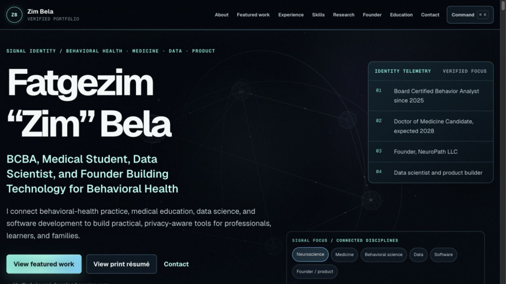
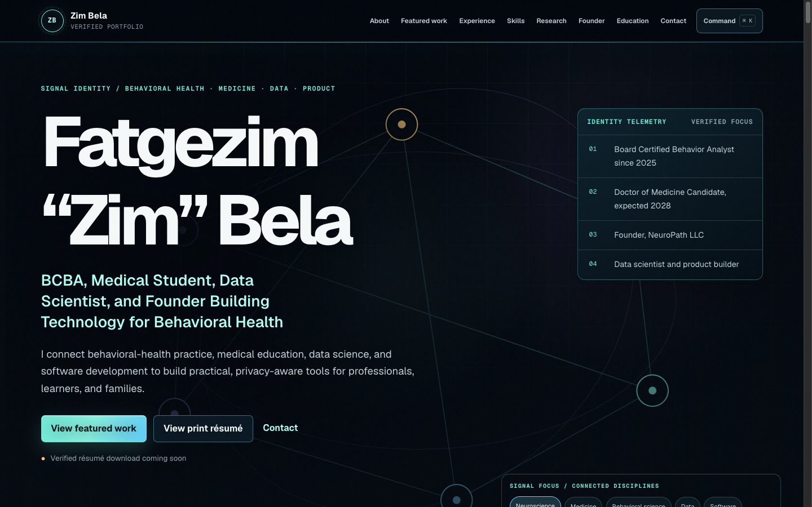
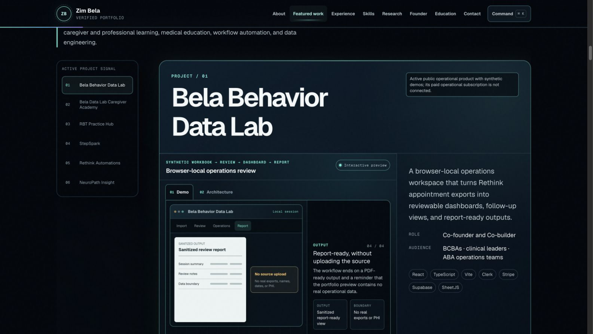
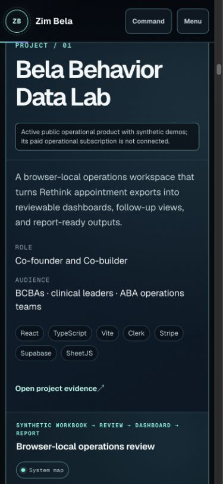
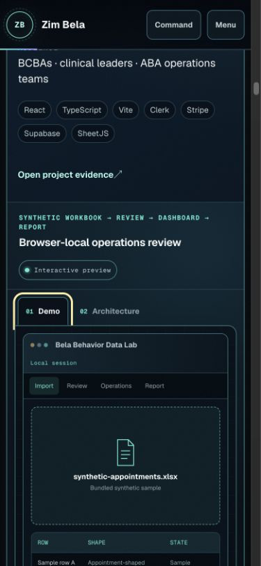
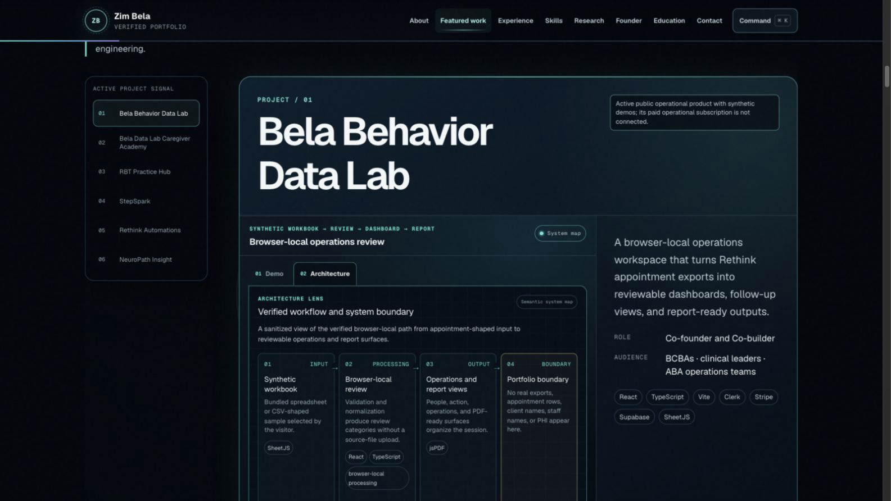
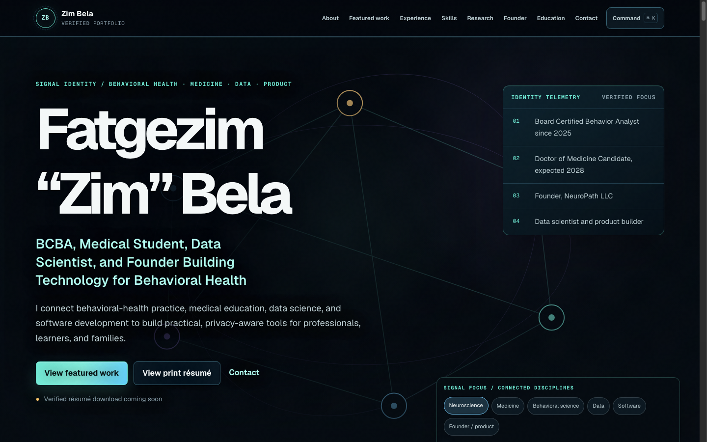
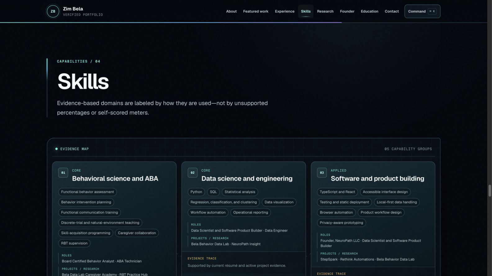
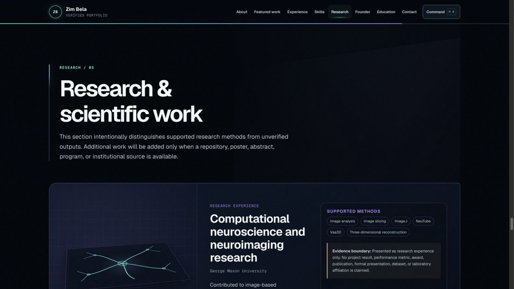
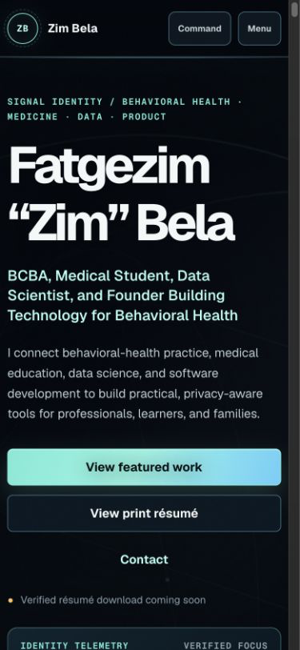

# Phase 2 Owner Review Report

Status: Visual system, motion, interaction, 3D, and project micro-demos complete — owner review required

Date: July 14, 2026

Phase boundary: This report closes Phase 2 only. No deployment, GitHub Pages change, production analytics, downloadable résumé change, or other Phase 3 work is included.

## Outcome

The approved Phase 1 portfolio has been transformed into a technical-hiring-first “neural command center” without changing its verified positioning, section order, featured-project set, or résumé facts.

The finished experience includes:

- a full-viewport procedural neural identity environment;
- a sticky desktop project lab and normal-flow mobile project cards;
- six truthful miniature product interfaces driven by one typed state model;
- a semantic Demo / Architecture Lens for every featured project;
- active-section navigation, a progress rail, and a keyboard command palette;
- SVG and CSS depth systems for experience, skills, research, founder context, education, and contact;
- static, content-complete reduced-motion, unavailable-WebGL, save-data, print, and no-JavaScript paths.

No portrait, stock art, generated likeness, heavy model, texture, video, sound, fake loading screen, scroll hijacking, external API, authentication system, private project data, PHI, or unsupported performance claim was added.

## Signature neural hero

The small Phase 1 signal card is now a full-viewport environment behind the approved hero content. Six procedural clusters represent neuroscience, medicine, behavioral science, data, software, and founder/product work. Bounded signal paths and particles connect those domains without carrying essential information.

The canvas is decorative and hidden from assistive technology. The same six domains are available as keyboard-operable buttons with a textual live status. Current-focus facts remain readable in the foreground telemetry rail.

The reduced-motion version replaces WebGL with an original static SVG composition. Headline, actions, facts, domain controls, and status text remain available.

## Navigation and command center

- Active-section navigation updates from ordinary document scrolling.
- A thin page-progress rail reflects the current reading position.
- `Cmd/Ctrl+K` opens a native modal command palette.
- Initial focus moves to the filter input; the native dialog traps focus; explicit close and native Escape/cancel both restore focus to the command button.
- The small-screen header keeps visible `Command` and `Menu` labels.
- The 820 ms signal-assembly entrance is decorative; the headline, links, and navigation are usable immediately.

## Featured Project Lab

Desktop uses a sticky project index on the left, a live mini-product stage in the center, and project summary/evidence on the right. Mobile returns to normal stacked document flow with explicit controls and no pinned scrolling.

Each preview supports Play, Pause, Replay, Previous, and Next. Hover or keyboard focus may start a short loop after a delay; touch and reduced-motion visitors retain explicit controls. Only one preview can play at a time, and playback pauses off screen or when the document is hidden.

The six sanitized workflows are:

| Project | Mini-product workflow | Public boundary retained |
|---|---|---|
| Bela Behavior Data Lab | synthetic workbook → validation → operations dashboard → report | Browser-local synthetic data; no real appointment export or billing/adoption claim. |
| Bela Data Lab Caregiver Academy | routine choice → guided lesson → knowledge check → printable tool | General education; no child profile, individualized plan, or clinical recommendation. |
| RBT Practice Hub | 19-task map → flashcard → original question → local progress | Independent study aid; no BACB affiliation, endorsement, or competence score. |
| StepSpark | original visual prompt → answer reveal → review state → provenance | Draft educational prototype; no medical validation, NBME affiliation, or exam prediction. |
| Rethink Automations | synthetic queue → confirmation → supported Step 1 → readable log | NeuroPath-adjacent local beta, not a deployed public NeuroPath product; Steps 2–6 and final control remain manual. |
| NeuroPath Insight | synthetic dataset → normalization → benchmark layout → model limitations | Private exploratory prototype; no customer result, clinical guidance, or financial recommendation. |

Mobile retains the same miniature interface and controls without hover dependence.

## Architecture Lens

Every preview can switch to a semantic input → processing → output → boundary map. Nodes contain verified technologies and plain-language descriptions; an edge ledger restates each relationship for linear reading. The four-column desktop path reflows to one vertical sequence on smaller screens and does not cause page-level horizontal overflow.

## Shared 3D runtime

The two procedural scenes share one direct Three.js runtime with:

- near-viewport dynamic loading of `three`;
- touch/lower-powered quality tiers;
- resize and visibility observers;
- a hard 2.5 million-pixel drawing-buffer ceiling;
- bounded fine-pointer camera response;
- off-screen and hidden-document pause/resume;
- reduced-motion, save-data, unsupported-WebGL, and context-loss fallbacks;
- renderer, geometry, material, buffer, and scene disposal.

Runtime inspection at the 1600 px test viewport measured 1,542,205 pixels for the hero buffer and 1,215,872 pixels for the project buffer. Only the visible scene reported `running`; the other reported `paused`.

A six-project lifecycle sweep kept the project renderer stable at five geometries, zero textures, and three programs while its theme and target geometry changed. A forced policy-disposal cycle reduced the hero from 6 / 0 / 3 and the project core from 5 / 0 / 3 geometries / textures / programs to 0 / 0 / 0, marked both controllers disposed, and reset both canvases to 1 × 1. The project core then cleanly reinitialized at the same 5 / 0 / 3 count.

The unavailable-WebGL test kept the hero content, project content, controls, evidence, and semantic interface intact. The capture below shows the static SVG neural composition rendered with WebGL disabled; runtime state simultaneously reported `fallback`, `paused`, and `unsupported-webgl`.

## Supporting sections

- Experience uses a restrained SVG career signal path while keeping each milestone as an ordinary article.
- Skills now maps every capability group to named, verified roles and projects/research contexts rather than self-scored meters.
- Research uses original CSS perspective planes and a procedural neuron-tracing diagram around the readable research article.
- Founder context has an accessible linear relationship index alongside a decorative ecosystem diagram.
- Education and credentials use stable instrument readouts with no invented scores.
- Contact converges the visual signal system into direct email, LinkedIn, and GitHub actions without a third WebGL scene.

## Responsive and interaction verification

Browser checks used the live local Vinext site and explicit viewport overrides.

| Width | Page-level horizontal overflow |
|---:|---|
| 360 px | None |
| 390 px | None |
| 768 px | None |
| 1024 px | None |
| 1440 px | None |
| 1600 px | None |

Additional interaction evidence:

- direct `/#projects` and all same-page navigation anchors resolve;
- `/resume` renders one heading, the verified candidate status, no phone pattern, and no overflow;
- project Demo / Architecture tabs respond to Arrow keys;
- the preview stage responds to Enter for play and pause;
- Play, Pause, Replay, Previous, and Next remain native labeled buttons;
- starting a second preview pauses the first;
- real touch events changed every one of the six preview stages from paused to playing without hover, while the one-active-preview rule remained intact;
- command palette shortcut, initial focus, focus containment, explicit-close restoration, and native Escape/cancel restoration pass;
- the browser console contains no application warnings or errors;
- the live page remains readable from server-rendered HTML without JavaScript.

## Reduced motion and failure modes

A headless Chrome run with forced reduced motion reported:

- `prefers-reduced-motion: reduce` matched;
- document reveals switched to `static`;
- all six demos reported `data-motion="reduced"`;
- both scenes reported `fallback` and `paused` with reason `reduced-motion`;
- both canvas elements were `display: none`;
- zero running CSS or Web Animations API animations.

Chrome with WebGL disabled reported `unsupported-webgl` and a visible static fallback while hero actions and all six domain buttons remained present. A real `WEBGL_lose_context` extension test changed the active scene to `fallback`, `paused`, reason `context-lost`; the same actions and domain controls remained usable.

A separate save-data emulation run set `navigator.connection.saveData` to `true` while reduced motion remained off. Both scenes reported `fallback`, `paused`, reason `save-data`; neither controller initialized and both drawing buffers remained at 1 × 1.

## Performance and bundle evidence

The build keeps Three.js in a separate dynamically requested client chunk. A clean build of the pre-redesign checkpoint (`7577ad0`) provides the Phase 1/base-route comparison:

| Client chunk | Phase 1 raw / gzip | Phase 2 raw / gzip | Change |
|---|---:|---:|---:|
| Main index | 81,749 / 24,694 B | 82,570 / 25,026 B | +821 raw (+1.00%); +332 gzip (+1.34%) |
| Project preview | 16,688 / 5,665 B | 73,035 / 20,162 B | +56,347 raw; +14,497 gzip |

The base index remained within 1.4% of its compressed Phase 1 size. The deliberate project-preview increase contains the six typed miniature interfaces and Architecture Lens; the much larger Three.js engine remains isolated from both chunks and is requested only when an allowed scene approaches the viewport.

Current Phase 2 chunks:

Gzip figures use `gzip -n` so filename and timestamp headers do not affect the comparison.

| Client chunk | Raw | Gzip |
|---|---:|---:|
| Three.js dynamic chunk | 724,480 B | 182,591 B |
| Main index chunk | 82,570 B | 25,026 B |
| Featured-project client chunk | 73,035 B | 20,162 B |

Vinext emits a generic greater-than-500 kB warning for the raw Three.js chunk. The dependency is not folded into the main index chunk and is imported only when an allowed scene approaches the viewport. No model, texture, image, or video payload is part of either 3D scene.

## Verification results

| Check | Result |
|---|---|
| `npm run lint` | Pass. |
| `npx tsc --noEmit --incremental false` | Pass. |
| `npm test` | Pass; build plus four rendered-HTML tests. |
| `npm run build` | Pass; `/` and `/resume` produced. |
| `git diff --check` | Pass. |
| `python3 scripts/validate-pack.py` | Pass. |
| Browser console | Pass; no application warning or error. |
| Responsive reflow | Pass at 360, 390, 768, 1024, 1440, and 1600 px. |
| Keyboard and focus | Pass for command palette, project tabs, stage, and explicit controls. |
| Reduced motion | Pass; static scenes and no autoplay/active animation. |
| Save-data policy | Pass; both scenes stayed paused in static fallback with 1 × 1 buffers. |
| WebGL unavailable/context loss | Pass; static content and controls remain usable. |
| Renderer lifecycle | Pass; six project transitions held 5 / 0 / 3 resources and disposal reached 0 / 0 / 0. |
| Public project links | Five project URLs and GitHub profile returned 200. LinkedIn returned its expected automated-request code 999; the URL remains owner-confirmed. |

The only build notice is Vinext's expected large-chunk warning for the isolated Three.js module and its existing inability to classify the two routes statically. Neither is a build failure.

## Action-marker resolution

- Browser verification, screenshots, accessibility review, the Git checkpoint, and bounded visual/accessibility subagents were used directly.
- No generic generated artwork was created because the approved implementation plan explicitly requires procedural geometry only. Original SVG, CSS, and Three.js assets provide the intended result.
- A separate Figma artifact was not introduced into the implementation workflow; the final design system remains editable in its source HTML, CSS modules, SVG, and typed component data.
- No generic accessibility skill was installed. The fallback combined semantic implementation, a dedicated read-only accessibility audit, keyboard and focus tests, reduced-motion emulation, six-width reflow checks, failure-state simulation, and manual screenshot review.

## Main files added or changed

Navigation and visual system:

- `app/components/navigation/*`
- `app/components/Hero.tsx`
- `app/components/SiteHeader.tsx`
- `app/components/SiteFooter.tsx`
- `app/globals.css`

Spatial runtime:

- `app/components/spatial/*`
- `package.json`
- `package-lock.json`

Project lab and demos:

- `app/components/FeaturedProjects.tsx`
- `app/components/project-demos/*`

Supporting sections:

- `app/components/About.tsx`
- `app/components/Experience.tsx`
- `app/components/Skills.tsx`
- `app/components/Research.tsx`
- `app/components/FounderContext.tsx`
- `app/components/EducationCredentials.tsx`
- `app/components/Contact.tsx`
- `app/components/supporting/*`

Evidence:

- `docs/portfolio/phase-2-report.md`
- `docs/portfolio/screenshots/phase-2-*`
- `PLANS.md`
- `phase-state.json`

## Owner review and hard stop

Please review the live hero, first project Demo and Architecture views, mobile project flow, reduced-motion composition, and the six project boundaries above.

Phase 2 is complete. Phase 3 deployment, final optimization, production accessibility tooling, SEO/social metadata, résumé-download behavior, and final documentation have not begun.

`[[STOP: OWNER APPROVAL REQUIRED]]`
